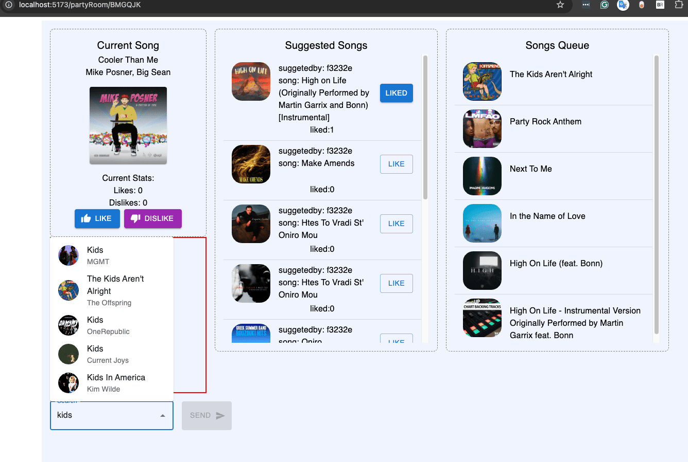
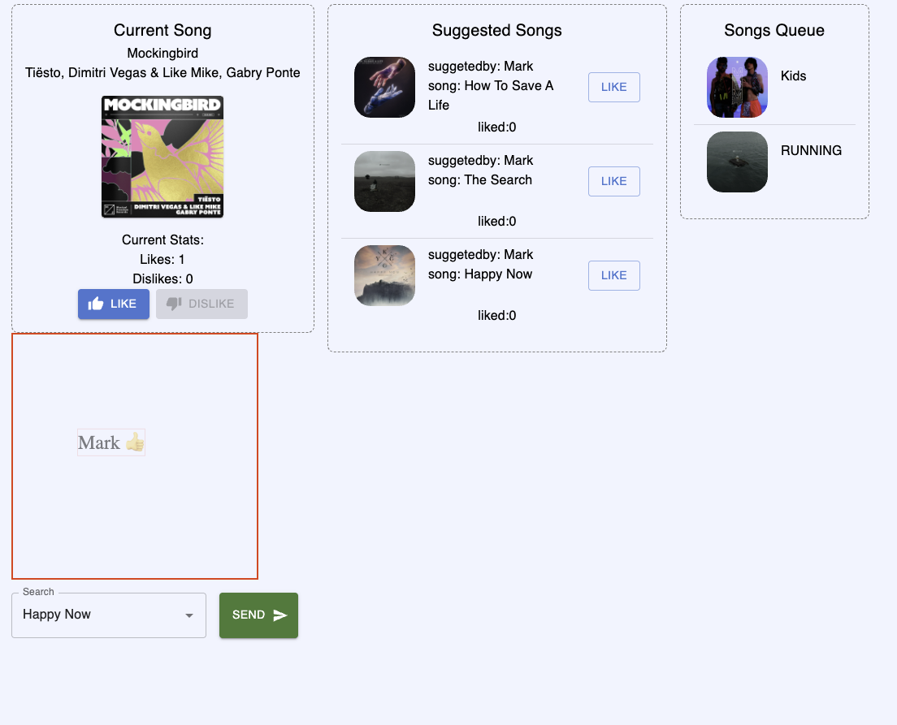
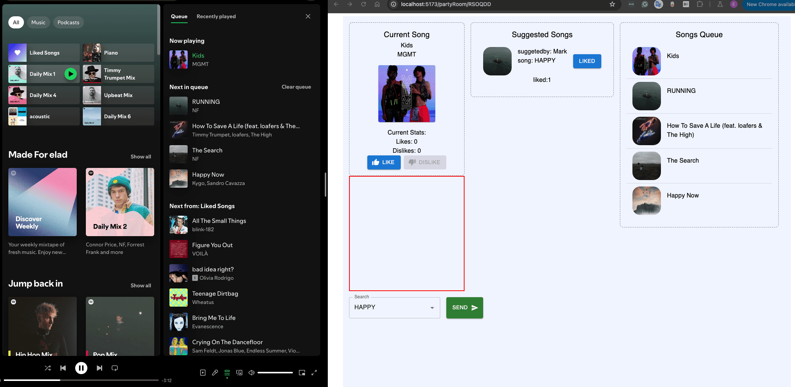

# RoomParty API Documentation

## **Project Overview**

RoomParty is a music-sharing platform built with Django as the backend and React for the frontend. The goal of this project is to explore and learn Python and Django while creating an interactive music room experience. Users can host or join rooms, suggest songs, vote on tracks, and interact in real time with Spotify integration for seamless music playback.

## Images

- Full working dashboard



- when user like the current song



- the effect from the project on the spotify native media player



## **Setup and Configuration**

### **Backend Setup**

1. Clone the repository and install dependencies.

   ```bash
   git clone <repo_url>
   cd roomparty-backend
   pip install -r requirements.txt
   ```

2. Apply migrations to set up the database:

   ```bash
   python manage.py migrate
   ```

3. Run the development server:

   ```bash
   python manage.py runserver
   ```

### **Frontend Setup**

- Install frontend dependencies, configure environment variables for API endpoints, and run the React app.

---

## **Backend Structure**

### **Core Models Overview**

#### Models (API)

1. **customUserModel**: Extends Django's user model to include custom fields like `room` and `host`, and manages user authentication tokens.
2. **roomModel**: Handles room creation and management, including room keys, host information, and voting requirements.
3. **songs_queue**: Stores and manages the queue of songs that will be played in the room, ordered by priority.
4. **suggestedSongsVotesModel**: Tracks user votes for suggested songs, allowing users to vote for songs they want added to the queue.
5. **suggestedSongsModel**: Stores songs suggested by users for a room and interacts with voting to determine their order in the queue.
6. **votesModel**: Tracks votes (likes/dislikes) for the currently playing song in a room and updates real-time voting stats.
7. **VoteUserModel**: Records each user's vote action on a song in a room, providing detailed voting history.

---

#### Models (Spotify Integration)

1. **SpotifyToken**: Manages Spotify access tokens and refresh tokens for authenticated users, enabling interaction with Spotify’s API.

---

### **API Endpoints Overview**

#### User Management (api/)

- **createUser**: Registers a new user with authentication tokens (access and refresh).
- **newAccessToken**: Generates a new access token using the refresh token.
- **getUserInfo**: Retrieves user information.
- **isUserInRoom**: Checks if a user is in a specific room.

#### Room Management (api/)

- **createRoom**: Creates a room with a unique key. If a user already owns a room, the old one is deleted.
- **joinRoom**: Adds a user to an existing room using a valid room key.
- **getRoomInfo**: Fetches detailed information about a specific room.

#### Voting System (api/)

- **vote**: Allows users to vote on the current song playing in their room (like/dislike).
- **suggestSongVote**: Users vote on suggested songs for a room.
- **suggestSongUserVote**: Retrieves the voting information of users for suggested songs.

#### Song Management (api/)

- **changeSong**: Changes the currently playing song in a room and resets votes.
- **songsQueue**: Manages the song queue, retrieving and adding songs for playback.

#### Suggested Songs Logic

- **suggestSong**: Users can suggest songs to be played next. Songs with the most votes are prioritized and added to the room’s queue.
  - **Queue Logic**: The queue is kept filled with up to 5 songs. When the queue has fewer than 5 songs, new songs are added based on user votes.

#### Spotify API Endpoints (spotify/)

- **get-auth-url**: Provides the OAuth URL for Spotify authentication.
- **redirect**: Handles Spotify authentication redirection and processes access tokens.
- **is-Authenticated**: Checks if the user is authenticated with Spotify.
- **set-spotify-username**: Stores the Spotify username of the user.
- **current-song**: Retrieves the currently playing song for a user.
- **search-song**: Allows users to search for songs via Spotify API.
- **return-spotify-access-token**: Returns a Spotify access token for authenticated requests.

---

### **WebSocket Integration**

- Uses Django Channels to enable WebSocket connections for real-time data transfer between the backend and frontend.
- WebSocket messages are triggered by signals when certain models are updated, ensuring real-time updates for song changes, votes, and suggestions.
- The frontend React app listens to these WebSocket updates and re-renders components accordingly.

---

### **Signals**

A single section handling all signals used for model state updates and WebSocket notifications:

1. **`update_vote_count_in_vote_model_by_voteUserModel`**:

   - **Triggered by**: `UserVotesModel`
   - **Action**: On save/delete of a user's vote, the vote count in `votesModel` is updated.

2. **`update_vote_count_after_delete`**:

   - **Triggered by**: `UserVotesModel`
   - **Action**: Updates `votesModel` when a user vote is deleted.

3. **`cleanup_in_UserVotesModel_when_song_change`**:

   - **Triggered by**: `VotesModel` (pre-save)
   - **Action**: Cleans up votes in `UserVotesModel` and updates the song queue when a new song is played.

4. **`sockets_trigger`**:
   - **Triggered by**: Changes in `VotesModel`, `UserVotesModel`, `suggestedSongsVotesModel`, `suggestedSongsModel`, and `SongsQueueModel`.
   - **Action**: Sends WebSocket updates to the frontend based on model changes to keep the app state synchronized in real-time.

---

## **Spotify Authentication**

After a room is created, users are redirected to the Spotify OAuth2 page to log in with their Spotify credentials. Upon authentication, Spotify tokens (access and refresh) are stored and utilized to manage Spotify interactions like song search and playback.

---

## **Frontend Structure and Components**

1. **RoomParty Page**: The main page of the app, containing the core components and state management for all features.
2. **Current Song Box**: Displays the current song’s details (name, artist, image) and voting buttons to like/dislike the song.
3. **Suggested Song Box**: Allows users to suggest songs by typing in a search box, which uses Spotify API with debouncing for optimization.
4. **Suggested Songs List**: Shows all user-suggested songs, votes on each suggestion, and integrates voting logic.
5. **Queue Component**: Displays the next songs to be played in the room based on votes and suggestions.
6. **Animations**: Real-time feedback animations for user actions (e.g., liking a song, suggesting a song).

---

## **Testing and Future Work**

### **Testing**

- **Backend Testing**: Ensure all API endpoints work as expected and cover edge cases.
- **Frontend Testing**: Test all components, interactions with the backend, and WebSocket updates.

### **Future Work**

- **Song Change Detection**: Implement functionality to detect when a song changes in the Spotify player.
- **Access Token Refresh**: Improve handling of Spotify tokens to ensure seamless playback and data fetching.

---

This version should give you a clearer and more professional overview for developers to understand the project and track remaining tasks effectively. Let me know if any specific details need to be further adjusted!
